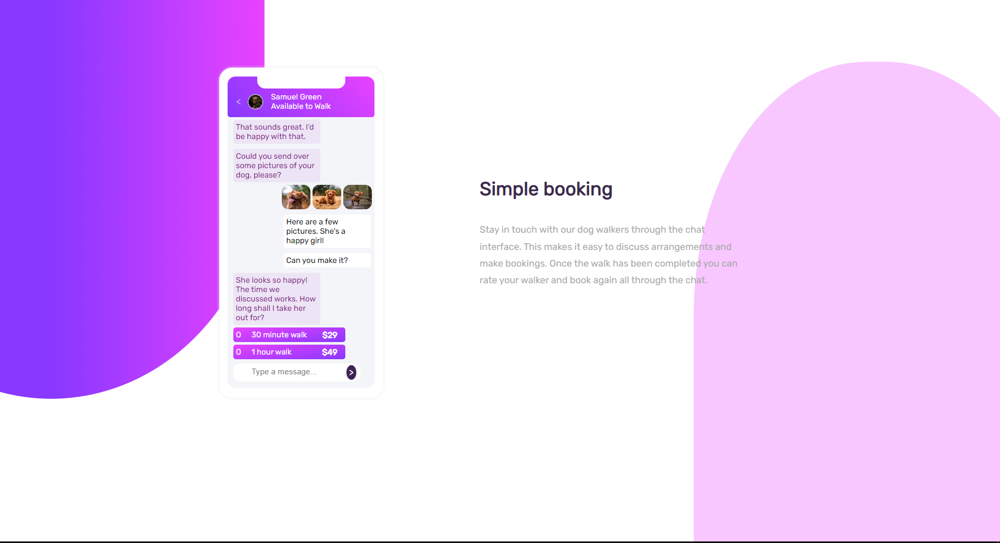

# Frontend Mentor - Chat app CSS illustration solution

Welcome to David Bayodes solution to the [Chat app CSS illustration challenge on Frontend Mentor]

## Table of contents

- [Overview](#overview)
  - [The challenge](#the-challenge)
  - [Screenshot](#screenshot)
  - [Links](#links)
- [My process](#my-process)
  - [Built with](#built-with)
  - [What I learned](#what-i-learned)
  - [Continued development](#continued-development)
  - [Useful resources](#useful-resources)
- [Author](#author)
- [Acknowledgments](#acknowledgments)

## Overview

### The challenge

This has been the most challenging css work I've ever done, the whole design save for the dog images, profile picture and google icons was made with CSS(thankfully using sass) and HTML.
The most challenging aspect was positioning everything where it would fit the design pixel perfectly, it does not scale to every resolution(as it is not the point), but scales very well for desktop. 

### Screenshot

Used my windows snipping tool to take a snapshot of what it looks like on my machine.

### Links

- Solution URL: [Add solution URL here](https://your-solution-url.com)
- Live Site URL: [Add live site URL here](https://your-live-site-url.com)

## My process

I started with the HTML markup, making sure all elements were semantically arranged as I had to make due with using only the box-model to create convincing box-shadows, padding and margins resembling a mobile device.
The best part was getting the linear-gradient property correctly.

### Built with

- Semantic HTML5 markup
- CSS custom properties
- Flexbox
- CSS Grid

### What I learned

I learnt that with enough patience, even the most impossible looking layouts can be done. The ability to use pure HTML and CSS to match mockup designs are often neglected but this was a joy to get right(enough :) ).

### Continued development

If I do come back to this project, it would be for tutorial purposes, as I've found the best way to learn is to teach.

### Useful resources

- [Example resource 1](https://developer.mozilla.org/en-US/docs/Web/CSS) - The documentation you'll need when you get stuck.
- [Example resource 2](https://www.geeksforgeeks.org/css/) - They have great tutorials for CSS.

## Author

- Website - [Add your name here](https://www.your-site.com)
- Frontend Mentor - [@yourusername](https://www.frontendmentor.io/profile/David4bay)
- Twitter - [@yourusername](https://www.twitter.com/Davidbay01)

## Acknowledgments

I'd like to thank Frontend Mentor for pushing my CSS skills to the limit.